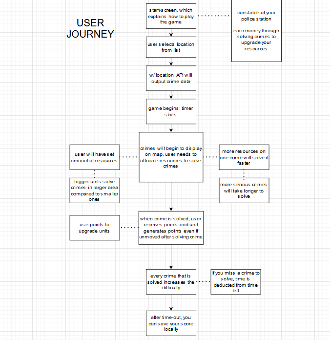

# Police: Crime-Fighter

## About this Project

```
This project is a fun, boredom-killing time-passer clicker game, which can save your high-score locally so you can compare how far you got with your friends.
```

## Links to the Project

- Click the link [here](https://github.com/SkyIsNotGreen/police-crime-fighter) to access our github repository.
- Click the link [here](https://skyisnotgreen.github.io/police-crime-fighter/) to access our deployed URL.

<br>

## User Story

```
As a user, I want to be able to be able to interact with real crime statistics in a quick and engaging way.

Before playing the game, I want to know how to interact with this app.

I want to be able to save my scores and compare my results with others on the same machine.

I want to see who created this game, and have access to more of their work!

I want to have the website to be responsive so I can still interact with all the features on a mobile viewport.

```

## Details of the steps in flowcharts

<br>

### Logic diagrams

<br>

Here is our flow chart detailing the user journey


<br>

At function level - logic of the page

<details>
<summary> 1. function two - game logic</summary>


</details>

<details>
<summary> 2. function three - render highscore logic</summary>


</details>

<br>

## Mock-Up

The following screenshots within the toggles show the web application's appearance and functionality:

<details>

<summary>Desktop ViewPort | Home  </summary>

_*Index.html*_

</details>

<details>

<summary>Desktop ViewPort |  How-to-Play Tutorial  </summary>

_*how-to-play.html*_

</details>

<details>

<summary>Desktop ViewPort | User Input  </summary>

_*user-input.html*_

</details>

<details>

<summary>Desktop ViewPort | Game  </summary>

_*game.html*_

</details>

<details>

<summary>Desktop ViewPort |  Scores </summary>

_*scores.html*_

</details>

<details>

<summary>Desktop ViewPort |  Contacts </summary>

_*contacts.html*_

</details>

## Technologies Used

- Git
  <br>
- Languages:<br>
  1. HTML <br>
  2. CSS <br>
  3. JavaScript<br>
  4. JQuery<br>
     <br>
- APIs: <br>
  1. Police API<br>
  2. Google Maps API<br>
     <br>
- Frameworks:<br>
  1. Font awesome<br>
  2. Bulma (CSS framework)<br>
  3. Gppgle Fonts<br>

<br>

## Future developments

There were many things we wanted to add but simply didn’t have the time to implement.

- Improve gameplay by adding an area radius to the units so they solve crimes in an area
- Add upgrades for units so you have ways of spending collected cash
- Add a functioning global highscores
- Add other map areas, so you can use your local area when you are playing the game
- Create a share button where you can share your scores on different social media platforms.
- Add onClick function to cards so that they flip on click then hover
- Add a pause and play button to demonstration video so that users can gain more understanding.

<br>

## How To Contact Us

### Jinyi Yu

- Email: yujinyiicxk@gmail.com
- Github: https://github.com/jinyiyu
- LinkedIn: https://www.linkedin.com/in/jinyiyu/
  <br>

### Ricky Palmer

- Github: https://github.com/SkyIsNotGreen
  <br>

### Josh Holmes

- Github: https://github.com/glowingmanagement
  <br>

### Amirtha Muthirulandi

- Github: https://github.com/amirtha-coder
  <br>
