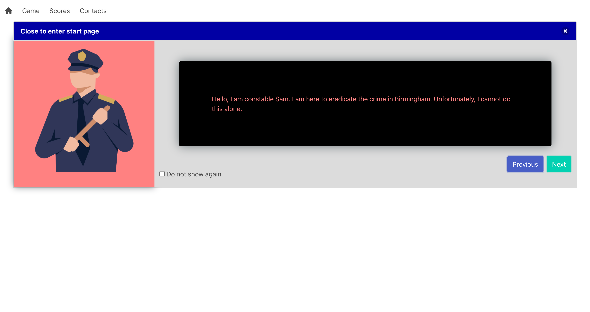
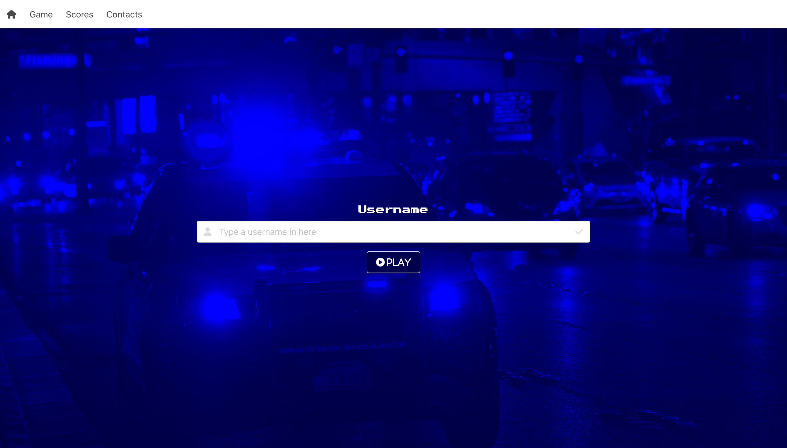
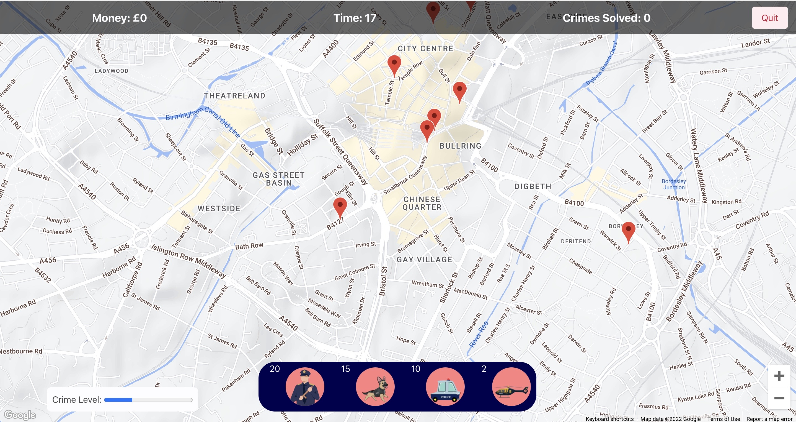
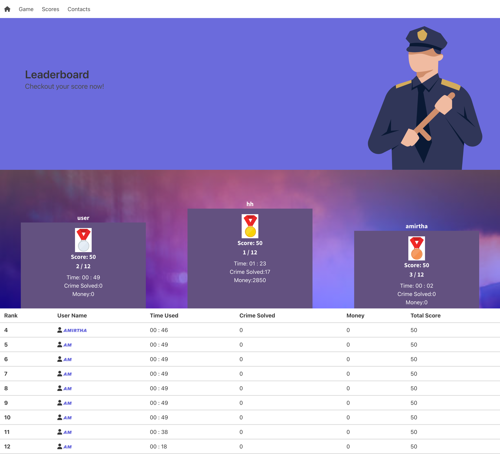
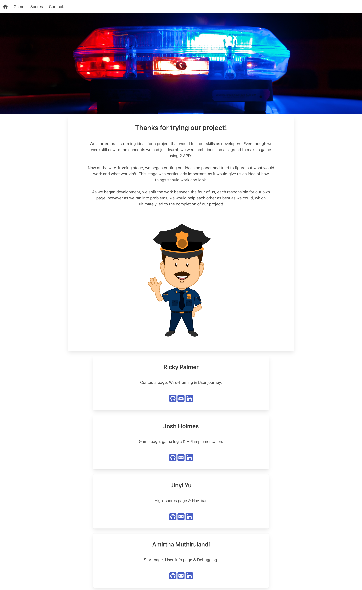

# Police-Crime-Fighter

## Deployed URL:

[Click Here](./assets/images/codequizhome.png) to access our project

## Description

A game-based project that uses data from the Police API to display markers that the user can then solve with specific resources.

### User Journey

## Screenshots

Desktop ViewPort | Home Page 

Home Page

Desktop ViewPort |  How-to-Play Tutorial Page 

How-to-Play Tutorial Page

Desktop ViewPort | User Input Page 

User Input Page

Desktop ViewPort | Game Page 

Game Page

Desktop ViewPort |  Scores Page 

Scores Page

Desktop ViewPort |  Contacts Page 

Contacts Page

## Technologies

- html
- css
- coolers
- javascript
- git
- bulma
- Police Data API
- Google Maps API
