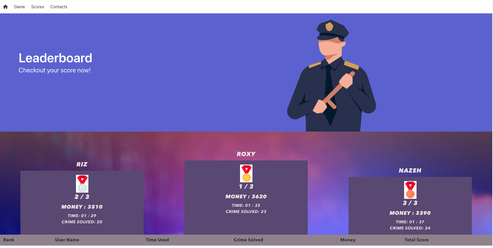

# Police: Crime-Fighter

## About this Project

```
This project is a fun, boredom-killing time-passer clicker game, which can save your high-score locally so you can compare how far you got with your friends.
```

## Links to the Project

Link to the Github Repository: [https://github.com/SkyIsNotGreen/police-crime-fighter]

Link to the deployed URL: [https://skyisnotgreen.github.io/police-crime-fighter/]

<br>

## User Story

```
As a user, I want to be able to be able to interact with real crime statistics in a quick and engaging way.

I want to know how to interact with this app before actually using it.

I want to be able to save my progress and compare my results with others on the same machine.

I want to see who created this game, and have access to more of their work!

```

## Details of the steps in flowcharts

<br>

### Logic diagrams

<br>

Overall logic

description and put my overall diagrams here

<br>

At function level - logic of the page

<details>
<summary> 1. function two - game logic</summary>


</details>

<details>
<summary> 2. function three - render highscore logic</summary>


</details>

<br>

## Mock-Up

The following screenshots in the taggle list show the web application's appearance and functionality:

<details>
<summary> Index page - banner and features </summary>


</details>

<details>
<summary> Index page - preview vedio and map view</summary>


</details>

<details>
<summary> How to play tutorial page</summary>


</details>

<details>
<summary> user input page</summary>

</details>

<details>
<summary> game page</summary>


</details>

<details>
<summary> score page</summary>





</details>

<details>
<summary> contact page</summary>


</details>
<br>

## Technology Used

- Git
- Language: HTML, CSS JavaScipt
- APIs: Police API, Google Maps API
- Frameworks:<br>
  1.Font awesome<br>
  2.Bulma (CSS framework)<br>
  3.Gppgle Fonts<br>
  4.JQuery<br>

<br>

## Future developments

There were many things we wanted to add but simply didn’t have the time to implement.

- Improve gameplay by adding an area radius to the units so they solve crimes in an area
- Add upgrades for units so you have ways of spending collected cash
- Add a functioning global highscores
- Add other map areas, so you can use your local area when you are playing the game
- Create a share button where you can share your scores on different social media platforms.
- Add onClick function to cards so that they flip on click then hover
- Add a pause and play button to demonstration video so that users can gain more understanding.

<br>

## How To Contact Us

### Jinyi Yu

- Email: yujinyiicxk@gmail.com
- Github: https://github.com/jinyiyu
- LinkedIn: https://www.linkedin.com/in/jinyiyu/
  <br>

### Ricky Palmer

- Email:
- Github: https://github.com/SkyIsNotGreen
- LinkedIn:
  <br>

### Josh Holmes

- Email:
- Github: https://github.com/glowingmanagement
- LinkedIn:
  <br>

### Amirtha Muthirulandi

- Email:
- Github: https://github.com/amirtha-coder
- LinkedIn:
  <br>
